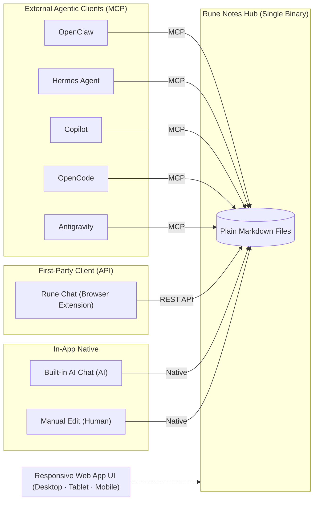

# Rune ᚱ

A high-performance, zero-trust AI agent built in Rust. Single binary, triple mode: interactive CLI assistant, Concourse CI resource type, and AI-native Data Exchange Hub (**Rune Notes**).

## Features

- **Zero-Trust Sandbox** — ALL tool executions run through 5 isolation layers (best-effort; the runtime applies these protections when available):
  - cgroups v2 resource limits (`systemd-run --scope`) — memory/PID limits
  - Network isolation (namespace or net-guard) (`unshare --user --net` or internal net-guard) — namespace-based isolation or domain-allowlist filtering
  - Seccomp BPF syscall filter (internal) — syscall filtering
  - Landlock filesystem restriction (internal) — file access limits
  - DNS / Domain allowlist — selective outbound network access (configured via `allowed_domains`)
- **Tool Calling** — 10 built-in tools (6 standard sandboxed tools + 4 serve-mode notes tools): `read_file`, `write_file`, `list_dir`, `execute_cmd`, `fetch_url`, `inspect_process`, `list_markdown`, `read_markdown`, `write_markdown`, `search_chat`
- **Rune Notes (Data Exchange Hub)** — AI-native Markdown hub served from the same single binary. Exposes Web UI, MCP endpoint, and REST API. Connects external agents (OpenClaw, Hermes, Copilot, OpenCode, Antigravity) with first-party browser extensions (Rune Chat) and built-in AI chat over plain Markdown files
- **Rich Markdown System** — Math notation (KaTeX inline/block), Mermaid diagrams-as-code, syntax highlighting (highlight.js), and raw inline SVG markup
- **Browser Extension (Rune Chat)** — Chrome and Firefox side-panel extension for contextual AI chat and seamless note sync
- **Command Policy** — Three modes: `allowlist` (default; whitelist only), `confirm` (interactive prompts), `unrestricted`
- **Skills System** — Load contextual abilities via `@skill_name` in prompts
- **Provider Registry** — GitHub Copilot (auto token refresh), OpenRouter (recommended), Google Gemini, any OpenAI-compatible
- **MCP Client & Server** — Stdio JSON-RPC client for external MCP servers + built-in HTTP MCP server endpoint (`POST /mcp`) for external agents
- **Streaming Output** — Interactive mode displays tokens incrementally as they arrive
- **Parallel Tool Calls** — Multiple independent tool calls execute concurrently
- **Context Window Management** — Auto-compact when context exceeds 85% of model limit
- **Vision / Image Input** — Multi-modal messages with text + images (base64 or URL)
- **Native Gemini Provider** — Google Gemini API with automatic message format conversion
- **Wildcard Domains** — `*.github.com` in allowed_domains matches all subdomains
- **Concourse CI** — Same binary acts as a resource type (`check`, `in`, `out`) via symlink
- **Trace Recording** — JSON trace files with sensitive info redaction
- **JSON Output** — `--json` flag for machine-readable output
- **Vim / Neovim Integration** — Native FIM ghost text completion and interactive commands (`:RuneAsk`, `:RuneEdit`, `:RuneStatus`, `:RuneLog`) built into the binary via `--features vim`
- **Non-Interactive Pipe Mode** — piped stdin runs once and exits; no interactive prompt loop

## Quick Start

```bash
# Build (single binary)
cargo build --release

# Interactive setup
./target/release/rune init

# Or configure manually
mkdir -p ~/.rune
cat > ~/.rune/rune.toml << 'EOF'
model = "gpt-4o"
api_key = "ghu_your_github_copilot_pat"
skills_dir = "./skills"

[policy]
mode = "allowlist"
allowed_domains = ["wttr.in"]
allowed_commands = ["ls", "cat", "head", "ps", "echo", "uname", "free", "df", "date", "hostname"]
EOF

# Run
./target/release/rune
```


## Container Usage

Rune is available as a container image at `ghcr.io/fourdollars/rune`:

```bash
# First-time setup — creates ~/.rune/rune.toml interactively
docker run --rm -it -v ~/.rune:/home/rune/.rune ghcr.io/fourdollars/rune init

# Interactive mode (mount config)
docker run --rm -it -v ~/.rune:/home/rune/.rune ghcr.io/fourdollars/rune

# With skills directory
docker run --rm -it \
  -v ~/.rune:/home/rune/.rune \
  -v ./skills:/home/rune/skills \
  ghcr.io/fourdollars/rune

# Mount a project directory as working directory
docker run --rm -it \
  -v ~/.rune:/home/rune/.rune \
  -v $(pwd):/workspace -w /workspace \
  ghcr.io/fourdollars/rune

# Pipe mode (one-shot, non-interactive)
echo "Summarize the README.md in this project" | \
  docker run --rm -i \
  -v ~/.rune:/home/rune/.rune \
  -v $(pwd):/workspace -w /workspace \
  ghcr.io/fourdollars/rune --json --yes
```

**Rune Notes serve mode:**

```bash
docker run --rm -it \
  -v ~/.rune:/home/rune/.rune \
  -p 9527:9527 \
  ghcr.io/fourdollars/rune notes --bind 0.0.0.0 --port 9527
```


Available tags: `latest` (Debian-based, built from main branch), `<sha>` (specific commit).

## Vim / Neovim Integration

Rune includes a native, zero-dependency Vim/Neovim plugin built directly into the binary.

### Installation

```bash
# Build Rune with Vim support
cargo build --release --features vim

# Install the embedded plugin into ~/.vim/plugin/rune.vim and ~/.config/nvim/plugin/rune.vim
rune vim install
```

### Features & Commands

| Command | Description |
|---------|-------------|
| `:RuneAsk <question>` | Ask AI questions about current file or selection (opens side Markdown window `__Rune_Chat__`) |
| `:RuneExplain` | Explain current code in detail |
| `:RuneEdit <prompt>` | Refactor or modify current file based on instructions |
| `:RuneFix` | Automatically analyze and fix bugs/issues in current file |
| `:RuneStatus` | Show provider, model, in-flight requests, and rate limit budget |
| `:RuneLog` | Open side debug window (`__Rune_Log__`) displaying live JSON-RPC traffic and stderr |
| `:RuneToggle(!)` | Toggle inline autocompletion on/off (`!` for global, without `!` for buffer) |
| `:RuneEnable(!)` | Enable inline autocompletion (`!` for global, without `!` for buffer) |
| `:RuneDisable(!)` | Disable inline autocompletion (`!` for global, without `!` for buffer) |

### Keybindings

- `<Tab>`: Accept full completion suggestion
- `<C-g>w`: Accept next word of suggestion
- `<C-g>l`: Accept next line of suggestion
- `<C-g>]` / `<C-g>[`: Cycle completion candidates
- `<C-g>d`: Dismiss current ghost text suggestion
- `<C-x><C-u>`: Trigger Vim native user/keyword completion popup menu (`completefunc=rune#Complete`)

### Statusline Customization

Add `%{rune#statusline()}` and `%{rune#model()}` to your `~/.vimrc`:

```vim
set statusline=%f\ %m%r%=%{rune#statusline()}\ [%{rune#model()}]
```

## CLI Usage

```
        ᛟ ᚺ ᛊ ᛏ ᛒ ᛖ ᚹ ᛗ ᛚ ᛝ ᛟ
    ┌───────────────────────────────────┐
    │    ᚱ  ᚢ  ᚾ  ᛖ                     │
    │    Zero-Trust AI Agent            │
    │    v0.1.0 ⚡ sandboxed            │
    └───────────────────────────────────┘
        ᛟ ᚺ ᛊ ᛏ ᛒ ᛖ ᚹ ᛗ ᛚ ᛝ ᛟ

ᚱ› Show me hostname and disk usage
  ⚙ execute_cmd({"cmd": "hostname"})
  ✓ execute_cmd...ok
  ⚙ execute_cmd({"cmd": "df -h /"})

  ⚠ Execute? [Y/n] Y
  ⚠ Add 'df' to allowed_commands? [Y/n] Y
permanently allowed → saved to ~/.rune/rune.toml
    + command 'df' → allowed_commands
  ✓ execute_cmd...ok

────────────────────────────────────────────────────────────
- Hostname: rune-dev
- Disk: 42G used / 100G total
────────────────────────────────────────────────────────────
  📋 commands executed: 2
    ▸ hostname
    ▸ df -h /
  ⚡ [2 steps | 650 tokens | 2 tool calls]
```

### Commands

| Command | Description |
|---------|-------------|
| `<text>` | Send a prompt to the agent |
| `/help` | Show help |
| `/info` | Current session status (model, context, skills) |
| `/info context` | Detailed context breakdown |
| `/policy` | Show policy summary |
| `/policy full` | Full sandbox status |
| `/config` | Show configuration |
| `/tools` | List available tools |
| `/skills` | List available skills |
| `/trace` | Trace recording status |
| `/compact` | Compress conversation context |
| `/reset` | Clear conversation history |
| `/multi` | Multi-line input (end with `;;`) |
| `/version` | Show version |
| `/clear` | Clear screen |
| `/exit` | Quit |

In interactive mode, use ↑/↓ to browse previous prompts. History is persisted across sessions in `~/.rune/history`.

## Configuration

```toml
# ~/.rune/rune.toml
model = "gpt-4o"
api_key = "ghu_..."          # GitHub Copilot (auto-detected)
# provider = "github-copilot"  # explicit (auto-detected if omitted)
# api_key = "AIza..."        # Google Gemini (provider = "gemini")
# api_key = "sk-or-..."      # OpenRouter (provider = "openrouter")
# base_url = "https://..."   # Custom endpoint (not needed for Copilot/Gemini)

skills_dir = "./skills"
log_level = "warn"
# system_prompt = "You are a helpful assistant."  # optional: override default system prompt (AGENTS.md still appended)
# max_steps = 50          # default 50, 0 = unlimited
# timeout_secs = 30       # default 30, 0 = unlimited
# token_budget = 262144   # default 256k, 0 = unlimited
# trace = "/path/to/traces"  # empty = disabled
context_window = 128000       # model context window in tokens
# compact_threshold = 0.85   # auto-compact at this % of context_window
# compact_keep_last = 6      # keep last N messages when compacting

[policy]
mode = "allowlist"           # allowlist | confirm | unrestricted
allowed_commands = ["ls", "cat", "head", "ps", "echo"]
allowed_domains = ["wttr.in", "api.github.com"]
# allowed_syscalls = []    # dangerous syscalls to ALLOW through seccomp (empty = block all)
allowed_paths_rw = ["/tmp"]
allowed_paths_ro = ["/bin", "/usr", "/lib"]
# allowed_files_rw = []   # individual files with read-write access
# allowed_files_ro = []   # individual files with read-only access (e.g. ~/.netrc)
denied_paths = ["/root", "/etc/shadow"]
max_memory_mb = 512
max_pids = 64

# MCP client connections (optional) — Rune as MCP client connecting to external MCP servers
# [[mcp]]
# name = "my-mcp-server"   # unique name shown in /tools and /info
# command = "node"         # executable to launch
# args = ["server.js"]     # command-line arguments
# required = false         # if true, Rune refuses to start when this server fails
# timeout_secs = 30        # per-call timeout (default 30)
# [mcp.env]        # optional environment variables injected into the child process
# API_KEY = "abc123"
```

## MCP Client Configuration

Rune can connect to any number of external MCP servers (acting as an **MCP client**). Each server runs as a child process communicating over stdio JSON-RPC.

### Fields

| Field | Type | Default | Description |
|-------|------|---------|-------------|
| `name` | string | — | **Required.** Unique identifier shown in `/tools` and `/info`. |
| `command` | string | — | **Required.** Executable to launch (resolved via `PATH`). |
| `args` | array | `[]` | Command-line arguments passed to the executable. |
| `env` | table | `{}` | Extra environment variables injected into the child process. |
| `timeout_secs` | integer | `30` | Per-call timeout in seconds. Set to `0` for no timeout. |
| `required` | bool | `false` | If `true`, Rune exits at startup when this server fails to connect. |

### Single MCP Server

```toml
[[mcp]]
name = "filesystem"
command = "npx"
args = ["-y", "@modelcontextprotocol/server-filesystem", "/home/user/docs"]
```

### Multiple MCP Servers

Repeat `[[mcp]]` for each server — TOML array-of-tables syntax:

```toml
[[mcp]]
name = "filesystem"
command = "npx"
args = ["-y", "@modelcontextprotocol/server-filesystem", "/home/user/docs"]
required = true
timeout_secs = 10

[[mcp]]
name = "github"
command = "npx"
args = ["-y", "@modelcontextprotocol/server-github"]
[mcp.env]
GITHUB_TOKEN = "ghp_your_token_here"

[[mcp]]
name = "zhtw-mcp"
command = "zhtw-mcp"
args = ["--stdio"]
required = false
timeout_secs = 60
```

### With Environment Variables

Use `[mcp.env]` (inline table notation) to inject secrets without hardcoding them in args:

```toml
[[mcp]]
name = "my-private-api"
command = "/usr/local/bin/my-mcp-server"
args = ["--port", "0"]
[mcp.env]
API_KEY = "secret"
BASE_URL = "https://api.example.com"
```

> **Note:** `[[mcp]]` configures Rune as an **MCP client** connecting to external servers.
> The built-in MCP server endpoint (`POST /mcp`) exposed by `rune notes` is separate and
> always available when running in serve mode.

### Environment Variables

| Variable | Description |
|----------|-------------|
| `RUNE_API_KEY` | LLM provider API key |
| `RUNE_PROVIDER` | Provider name (github-copilot, gemini, openai, openrouter, ollama, anthropic) |
| `RUNE_MODEL` | Model name |
| `RUNE_BASE_URL` | Provider base URL |
| `RUNE_POLICY_MODE` | Policy mode override (legacy; prefer `[policy] mode` in config) |
| `RUNE_LOG_LEVEL` | Log level |
| `RUNE_TRACE` | Enable trace (true/false) |
| `RUNE_CONTEXT_WINDOW` | Model context window in tokens (default: 128000) |
| `RUNE_COMPACT_THRESHOLD` | Auto-compact trigger fraction (default: 0.85) |
| `RUNE_COMPACT_KEEP_LAST` | Keep last N messages during auto-compact (default: 6) |
| `RUNE_JSON_OUTPUT` | JSON output mode (`true` / `false`, also accepts `1` / `0`) |
| `RUNE_SYSTEM_PROMPT` | Custom system prompt (replaces default; AGENTS.md still appended) |
| `RUNE_YES` | Auto-approve dangerous tool execution (`true` / `false`, also accepts `1` / `0`) |

## Zero-Trust Sandbox

Every tool invocation passes through up to 5 isolation layers:

```
┌─────────────────────────────────────────────┐
│  Layer 1: cgroups (memory + pids limits)    │
│  Layer 2: net-guard (seccomp user notif)    │
│  Layer 3: Seccomp BPF (syscall filter)      │
│  Layer 4: Landlock (filesystem restriction) │
│  Layer 5: DNS allowlist (domain control)    │
└─────────────────────────────────────────────┘
```

### Sandbox Demo

#### ✅ ALLOWED — Operations that succeed:

```
ᚱ› (read /etc/hostname)
  ⚙ read_file({"path": "/etc/hostname"})
  ✓ read_file...ok → "u"

ᚱ› (write to /tmp)
  ⚙ write_file({"path": "/tmp/test.txt", "content": "hello"})
  ✓ write_file...ok → "Written 5 bytes"

ᚱ› (run allowed command)
  ⚙ execute_cmd({"cmd": "echo hello"})
  ✓ execute_cmd...ok → "hello"
```

#### ❌ BLOCKED — Operations that fail:

```
ᚱ› (fetch non-allowed URL)
  ⚙ fetch_url({"url": "https://example.com"})
  ✗ BLOCKED: domain 'example.com' is not in allowed_domains

ᚱ› (run non-allowed command in allowlist mode)
  ⚙ execute_cmd({"cmd": "rm -rf /"})
  ✗ BLOCKED by policy: command 'rm' is not in allowed_commands

ᚱ› (read sensitive file)
  ⚙ read_file({"path": "/etc/shadow"})
  ✗ Permission denied (Landlock + user namespace)

ᚱ› (ptrace attempt inside sandbox)
  → Seccomp BPF: Operation not permitted
```

### Command Policy
 
| Mode | Behavior | Default for |
|------|----------|-------------|
| `allowlist` | Auto-execute within allowlist, block everything else | Default for all modes (Interactive CLI, Pipe mode, Concourse CI) |
| `confirm` | Prompt Y/n before dangerous tool calls; blocked resources trigger Add-to-allowlist prompts | Opt-in via `mode = "confirm"` |
| `unrestricted` | All policy checks skipped | Opt-in via `--unrestricted` flag |

**Defaults by context:**
- **Interactive CLI** (`rune`): `allowlist` (default) — auto-executes within allowlist; use `mode = "confirm"` for interactive prompts
- **Pipe mode** (`echo "..." \| rune`): `allowlist` — runs within configured allowlists
- **Concourse CI** (check/get/put): `allowlist` — enforces sandbox policy from pipeline YAML

Override with `--unrestricted` flag or `RUNE_POLICY_MODE=unrestricted` env var:

```toml
[policy]
mode = "unrestricted"
```

In Concourse CI pipelines, set via `source.policy.mode`:

```yaml
resources:
  - name: my-agent
    type: rune-agent
    source:
      api_key: ((key))
      policy:
        mode: unrestricted
```

## JSON Output Mode

```bash
echo "What is 2+2?" | rune --json
```

```json
{"answer":"4","steps":1,"tokens":348,"tools_used":[]}
```

## CLI Flags

```bash
# Machine-readable output
rune --json

# Skip confirm prompts for dangerous tools
rune --yes
# or
rune -y
```

## Pipe / Non-Interactive Mode

When stdin is piped into Rune, it runs in one-shot non-interactive mode:

```bash
echo "Get weather for Taoyuan from wttr.in" | rune --json --yes
```

Behavior in pipe mode:
- reads all stdin as a single prompt
- does **not** enter the interactive prompt loop
- exits immediately after one run
- if confirm mode would require approval, Rune stops with an error unless `--yes` is provided

## Skills

```
skills/
├── sysadmin/
│   └── SKILL.md
└── launchpad/
    ├── SKILL.md
    └── references/
```

Use `@skill_name` in prompts:
```
ᚱ› Use @sysadmin skill. Check disk usage.
  📚 Loaded skill: sysadmin
```

For scripting, combine skills with pipe mode:
```bash
echo "Use @sysadmin skill. Check disk usage." | rune --json --yes
```

## Rune Notes (AI-Native Data Exchange Hub)

Rune Notes is a responsive web app and an **AI-native Markdown system**, acting as the central **Data Exchange Hub**. It ships as a **single self-contained executable** — one process serves the web UI, the MCP endpoint, and the REST API.

All clients converge on plain Markdown files stored on the local filesystem as the **single source of truth**.

```bash
# Start Rune Notes server
rune notes --bind 0.0.0.0 --port 9527
```

### Architecture



### Key Highlights

- **Single Self-Contained Binary** — Zero external runtime, no VM or dependency chain. Self-contained on Linux with kernel-level isolation.
- **Universal Client Access**:
  - **External Agents over MCP**: Antigravity, OpenClaw, Hermes Agent, GitHub Copilot, and OpenCode interact directly with notebook workspaces via the built-in MCP endpoint (`POST /mcp`).
  - **First-Party Browser Extension**: **Rune Chat** (Chrome and Firefox) connects via REST API from the browser side-panel to chat about the active webpage and update notes in real-time.
  - **In-App Native**: Built-in AI chat agent and human editor manipulate the same Markdown files in place.
- **Rich Markdown Engine**:
  - **LaTeX / KaTeX Math** — Inline `$E=mc^2$` and display blocks `$$\int_{-\infty}^{\infty} e^{-x^2} dx = \sqrt{\pi}$$`.
  - **Mermaid Diagrams** — Flowcharts, sequence diagrams, and class diagrams rendered directly from text.
  - **Raw Inline SVG** — Directly embed `<svg>` markup for custom visual diagrams without image hosting.
  - **Syntax Highlighting** — Fenced code blocks with automatic language styling.
- **Adaptive Responsive Layout**:
  - **Desktop**: 3-column view (file navigator, Markdown editor, and AI chat side by side).
  - **Tablet**: Collapsible panels and touch-friendly targets.
  - **Mobile**: Single-column adaptive view with fast switching.
- **Real-Time Collaboration** — Server-Sent Events (SSE) stream AI tokens, user presence, and file changes live.

### Browser Extension (Rune Chat)

Rune includes a first-party browser extension located in `browser-extension/`:
- **Side Panel UI** — Chat with your Rune server about the webpage you're viewing without leaving the tab.
- **Chrome MV3 & Firefox MV3** — Shared codebase using WebExtension standards.
- **OAuth 2.1 PKCE** — Secure authentication flow directly to your Rune Notes server.
- **Build**:
  ```bash
  node browser-extension/build.js
  # Produces dist/chrome/ and dist/firefox/
  # Zipped automatically in CI as rune-extension-chrome.zip & rune-extension-firefox.zip
  ```

### Authentication & Providers

Rune Notes supports three authentication strategies:
1. **GitHub OAuth 2.0** — Easy login with role mapping via usernames or organizations/teams (`org:my-org/team`).
2. **OAuth 2.0 / OIDC** — Connect to Google, Okta, Authentik, Keycloak, or any standard OIDC identity provider.
3. **Local Static Password** — Standalone accounts for air-gapped or home-server environments.

**Supported LLM Providers:** OpenRouter (recommended), GitHub Copilot (auto token refresh), Google Gemini, and OpenAI-compatible endpoints.

### Configuration

```toml
[notes]
port = 9527
bind = "0.0.0.0"
thinking = "high"

# GitHub OAuth 2.0 Login
[notes.github]
client_id = "your_github_client_id"
client_secret = "your_github_client_secret"
admins = ["fourdollars", "org:my-org/ops"]
users = ["org:my-org"]
guests = []

# Local Static Password Login
[notes.local]
admins = ["admin:admin123"]
users = ["user:user123"]
guests = ["guest:guest123"]

# Third-party OAuth2/OIDC Login (multiple providers)
[[notes.oauth]]
name = "google"
display_name = "Google"
client_id = "your_oauth_client_id"
client_secret = "your_oauth_client_secret"
issuer = "https://accounts.google.com" # OIDC discovery
groups_claim = "groups"
admins = ["alice", "grp:platform-admins"]
users = ["grp:employees"]
guests = []
```

### Role Permissions

| Capability | Admin | User | Guest |
|---|:---:|:---:|:---:|
| View notes & files | ✅ | ✅ | ✅ (public only) |
| Read chat history | ✅ | ✅ | ✅ |
| Switch notes/files | ✅ | ✅ | ✅ |
| Chat with AI | ✅ | ✅ | ❌ |
| Create/edit/delete files | ✅ | ✅ | ❌ |
| Create/rename/delete notes | ✅ | ❌ | ❌ |
| Approve AI tool requests | ✅ | ❌ | ❌ |
| Toggle public visibility | ✅ | ❌ | ❌ |
| Switch AI model/thinking | ✅ | ❌ | ❌ |
| See model/thinking info | ✅ | ✅ | ❌ |

### Public Pages

Admin can toggle visibility (public/private) for individual notes and files. When set to public, anyone can view rendered Markdown without authentication at:

- **Index:** `http://host:port/notes/` — lists all public notes
- **Preview:** `http://host:port/notes/{note}/{filename}` — rendered Markdown page with KaTeX math, Mermaid diagrams, and syntax highlighting
- **Raw content:** `http://host:port/raw/{note}/{filename}`

## Concourse CI Resource Type

### Quick Start — Weather Check

The simplest possible pipeline using Rune as a Concourse CI resource type:

```yaml
resource_types:
  - name: rune-agent
    type: registry-image
    source:
      repository: ghcr.io/fourdollars/rune
      tag: latest

resources:
  - name: weather
    type: rune-agent
    check_every: 1h
    source:
      api_key: ((copilot-pat))
      model: gpt-4o-mini
      prompt: "Fetch the weather for Taoyuan from wttr.in using curl."
      policy:
        allowed_commands: ["curl"]
        allowed_domains: ["wttr.in"]

jobs:
  - name: weather-check
    plan:
      - get: weather
        trigger: true
      - task: show
        config:
          platform: linux
          image_resource:
            type: registry-image
            source: { repository: ghcr.io/fourdollars/rune, tag: latest }
          inputs: [{name: weather}]
          run:
            path: sh
            args: [-c, "cat weather/response.txt"]
```

That's it! Rune handles:
- AI prompt → tool selection → sandboxed execution → response
- Network filtering (only `wttr.in` allowed)
- Automatic version tracking (content hash)

### Detailed Usage

Rune acts as a content-aware Concourse CI resource type. **All three resource steps (`check` / `in` / `out`) run through the same sandboxed Rune agent pipeline as pipe mode.**

- `check` executes the prompt, hashes the final answer, and returns `{"ref":"sha256:..."}`
- `in` re-executes the prompt and writes `payload.json` + `response.txt`
- `out` executes `params.prompt` and returns a new version

When tool usage is needed, configure sandbox allowlists in the resource source (domains, paths, commands via Rune policy).

```yaml
resource_types:
  - name: rune-agent
    type: registry-image
    source:
      repository: ghcr.io/fourdollars/rune
      tag: latest

resources:
  - name: ai-news
    type: rune-agent
    source:
      api_key: ((copilot_key))          # ghu_/ghp_ auto-refreshed
      model: gpt-4o-mini
      prompt: "List top 3 trending AI topics today. One line each."
      policy:
        allowed_commands: ["curl", "ls", "cat"]
        allowed_domains: ["news.google.com", "api.github.com"]

jobs:
  - name: news-digest
    plan:
      - get: ai-news                    # triggers when content changes
        trigger: true
      - task: translate
        config:
          platform: linux
          image_resource:
            type: registry-image
            source: { repository: ghcr.io/fourdollars/rune, tag: latest }
          inputs: [{name: ai-news}]
          run:
            path: sh
            args: [-c, "cat ai-news/response.txt"]

  - name: ask-ai
    plan:
      - put: ai-news
        params:
          prompt: "Translate to zh-TW: AI is transforming healthcare."
```

### Resource Lifecycle

| Mode | Behavior |
|------|----------|
| `check` | Run sandboxed agent on `source.prompt` → sha256(final answer) → version `{"ref":"sha256:..."}` |
| `in` (get) | Run sandboxed agent again → write `payload.json` + `response.txt` to dest dir |
| `out` (put) | Run sandboxed agent on `params.prompt` → return version + print response to build log |

### Supported Providers

GitHub Copilot tokens (`ghu_`/`ghp_`) are auto-detected and refreshed. Google Gemini (`AIza*` keys) uses the native Gemini API format. OpenAI, OpenRouter, Ollama, Anthropic, and any OpenAI-compatible endpoint work via `base_url`. Use `--provider <name>` or `provider = "..."` in config to override auto-detection.

### Output Files (get step)

| File | Content |
|------|---------|
| `payload.json` | `{prompt, response, ref, model, timestamp}` |
| `response.txt` | Raw LLM response text |

## Architecture

```
src/
├── main.rs              — Entry point, routing
├── agent/mod.rs         — Agent loop, tool orchestration, confirm flow
├── cli/mod.rs           — Interactive CLI, commands, JSON mode
├── concourse/mod.rs     — Concourse CI check/in/out (sandboxed agent pipeline)
├── config/mod.rs        — Layered config + PolicyConfig
├── mcp/mod.rs           — MCP client (stdio JSON-RPC, [[mcp]] config)
├── precommands.rs       — Pre-command execution
├── provider/mod.rs      — LLM providers + retry backoff
├── sandbox/
│   ├── mod.rs          — 5-layer sandbox orchestration
│   ├── landlock.rs     — Landlock filesystem restriction (internal subcommand)
│   ├── seccomp.rs      — Seccomp BPF syscall filter (internal subcommand)
│   └── net_guard.rs    — Seccomp user-notif network filter (internal subcommand)
├── serve/
│   ├── mod.rs          — HTTP server, routes, auth middleware
│   ├── api.rs          — SSE handlers, chat, file/note CRUD, public pages
│   ├── db.rs           — SQLite persistence (sessions, file visibility)
│   └── static_files.rs — Embedded static assets (include_str!)
├── setup.rs             — rune init wizard
├── skills/mod.rs        — SKILL.md loader
├── tools/mod.rs         — 10 built-in tools (6 standard + 4 serve-mode)
├── embedding/mod.rs     — Embedding engine + vector store
└── trace/mod.rs         — JSON trace + redaction

web/
├── index.html           — Rune Notes SPA
├── app.js               — Frontend logic (SSE, editor, chat, auth)
├── style.css            — UI styles (light/dark, responsive)
├── favicon.svg          — Rune logo
├── marked.min.js        — Markdown rendering
├── mermaid.min.js       — Diagram rendering
├── katex.min.js/css     — LaTeX math rendering
├── highlight.min.js     — Syntax highlighting
└── highlight-dark.min.css
```

## Development

```bash
cargo build --release    # Single binary (~12MB)
cargo test               # Unit tests (762)
./tests/e2e.sh           # E2E tests (26)
make check-all           # Both
```

## Requirements

- Rust 1.78+ (tested on 1.94-nightly)
- Linux kernel 5.13+ (Landlock ABI), 5.0+ (seccomp user notification)
- `curl` on PATH (only needed inside sandbox for `fetch_url` tool) (only needed for sandboxed fetch_url tool)

## License

MIT
